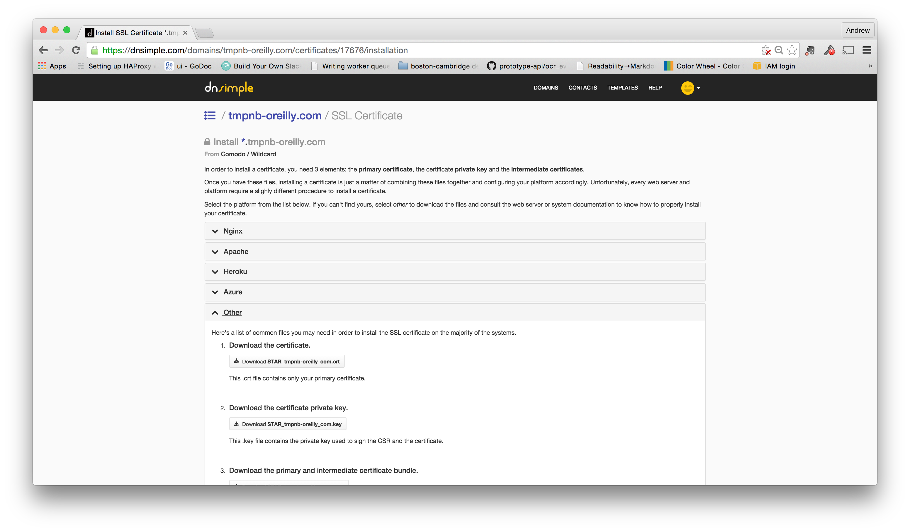

# tmpnb on Carina

This repo describes how to get tmpnb running on Carina.  Since Carina doesn't (yet) support static IPs, it also shows how to use [interlock](https://github.com/ehazlett/interlock) on another server to serve as a static IP where you can create a DNS entry and an SSL cert.


# Set up a cluster on Carina

Before dogin any of this, you need to install [cainra](https://github.com/getcarina/carina) CLI tool and start a cluster.  In this example, I've used a cluster called `somerville`.

There are 4 then main steps to configuring tmpnb:

* Set up your environment variables.  Note that the one big change you need to make is to set the `TMPNB_NODE` variable based on your cluster setup.  To find this value, run `docker info` and you'll see the various node names.  They'll have long uuid and then a suffix like `-n1`, `-n2` and so on.  This constraint will ensure that all the tmpb components run on the same node.

* Start `jupyter/configurable-http-proxy`

* Put the credentials on the nodes.  (This is just by `busybox`, which just copies them to the right place.)

* Start up the `tmpnb` server itself.  

NOTE: YOU MUST PULL THE IMAGE YOU WANT TO USE *BEFORE* YOU START `tmpnb`.  So, in this case, I did `docker pull zischwartz/sparkdemo`  

Here's a script that shows the exact commands:

```
export TOKEN=$( head -c 30 /dev/urandom | xxd -p )
export POOL_SIZE=5
export OVERPROVISION_FACTOR=2
export CPU_SHARES=$(( (1024*${OVERPROVISION_FACTOR})/${POOL_SIZE} ))
export TMPNB_NODE=bb0f0ccc-2dcb-410b-94cf-808c99324ab6-n1
export DOCKER_HOST=tcp://104.130.0.25:2376

docker run -d \
           -P \
           -h spark.tmpnb-oreilly.com \
            -e CONFIGPROXY_AUTH_TOKEN=$TOKEN \
            --restart=always \
            -e constraint:node==$TMPNB_NODE \
            --name=proxy \
            -u root \
            jupyter/configurable-http-proxy \
              --default-target http://tmpnb:9999 \
              --port 8000 \
              --ip 0.0.0.0 \
              --api-ip 0.0.0.0 \
              --api-port 8001

docker run --rm --volumes-from swarm-data \
          -e constraint:node==$TMPNB_NODE \
          busybox \
            sh -c "cp /etc/docker/server-cert.pem /etc/docker/cert.pem && cp /etc/docker/server-key.pem /etc/docker/key.pem"


docker run  -d \
           --restart=always \
           -e CONFIGPROXY_AUTH_TOKEN=$TOKEN \
           -e CONFIGPROXY_ENDPOINT="http://proxy:8001" \
           -e constraint:node==$TMPNB_NODE \
           --volumes-from swarm-data \
           --name=tmpnb \
           -e DOCKER_HOST=$DOCKER_HOST \
           -e DOCKER_TLS_VERIFY=1 \
           -e DOCKER_CERT_PATH=/etc/docker \
           jupyter/tmpnb python orchestrate.py \
              --image='zischwartz/sparkdemo' \
              --container_ip=0.0.0.0 \
              —-allow_origin="*" \
              --command="/bin/bash -c 'IPYTHON_OPTS=\"notebook --NotebookApp.base_url={base_path} --ip=0.0.0.0 --NotebookApp.allow_origin=*\" pyspark --packages com.databricks:spark-csv_2.10:1.2.0'" \
              --pool_size=$POOL_SIZE \
              --mem_limit='128m' \
              --cpu_shares=$CPU_SHARES
```

Once it's running, figure out your public IP address using `docker inspect tmpnb`.  The IP address will be in the "Node.IP" field in the big json blob.  You can also just do this:

```
$ docker inspect tmpnb | grep "\"IP\":"
        "IP": "104.130.0.7",
```

Visit this URL in your browser and you *should* get the tmpnb spawner.

# Kill nodes started by tmpnb

Here's a command to kill all the containers started by `tmpnb`:

```
docker rm -fv $( docker ps -aq --filter name=zischwartzsparkdemo )
```

# Setting up Interlock

Set up a server to run [Interlock](https://github.com/ehazlett/interlock).  Only, I'm using a variant called `carina/interlock` that was built to allow you to easily use carina credentials

* Start carina/interlock

```
docker run -d -p 80:80 --name=interlock carina/interlock \
   --username $CARINA_USERNAME  \
   --apikey $CARINA_APIKEY \
   --clustername somerville \
   --plugin haproxy start
```

Carina watches the swarm so that and when a new container launches with a public port and a hostname, it will make a proxy entry for it.  For example:

```
docker run -d \
   -p 8888 \
   -P   \
   --hostname nbtest.tmpnb-oreilly.com  \
   zischwartz/sparkdemo
```

* Start the tmpnb server using the host so that it gets a public DNS entry

# Interlock with ssl

* Buy a cert
* Configure the cert to get a PEM.  This is different for each provider.  :(
* In my case, I used DNSSimple and Comodo.  There's a good description of how to set this up at
https://lucianpantelimon.info/setting-up-haproxy-with-comodo-positivessl-certificates/

```
  cat STAR_tmpnb-oreilly_com.key >> STAR_tmpnb-oreilly.com.pem
  cat STAR_tmpnb-oreilly_com.crt >> STAR_tmpnb-oreilly.com.pem

  cat STAR_tmpnb-oreilly_com_bundle.pem.crt >> STAR_tmpnb-oreilly.com.pem
```



* Start Interlock using the cert


```
docker run \
   -d \
   -p 443:443 \
   -v /root:/ssl \
   -e HAPROXY_SSL_CERT=/ssl/STAR_tmpnb-oreilly.com.pem \
   --name=interlock \
   carina/interlock \
      --debug \
      --username $CARINA_USERNAME \
      --apikey $CARINA_APIKEY \
      --clustername somerville \
      --plugin haproxy start
```   
