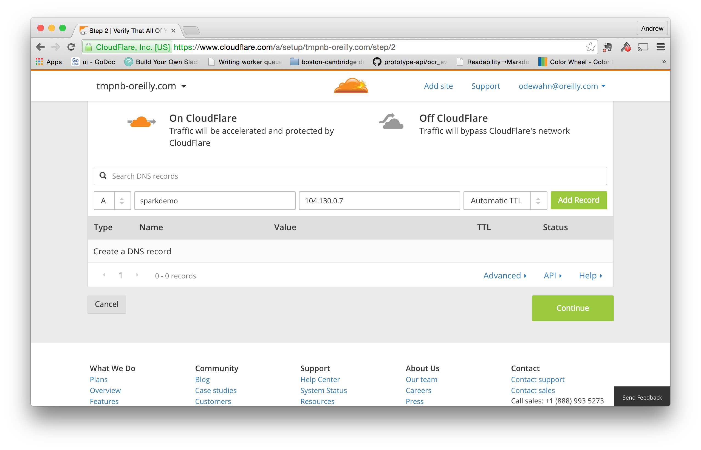
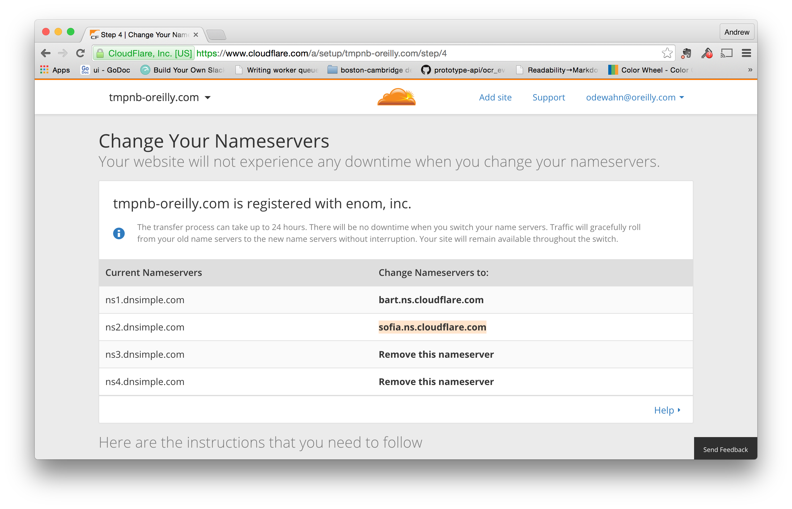

# Set up a cluster on Carina

## Install this:

https://github.com/rackerlabs/carina/releases

## Copy it to a directory on your path and make it executable

```
$ mv carina-darwin-amd64 /usr/local/bin/carina
$ chmod +x /usr/local/bin/carina
```

## Setup environment variables

```
export RACKSPACE_USERNAME=makerpressadmin
export RACKSPACE_APIKEY=<your API key>
```

## List the clusters:

```
$ carina list
ClusterName	Username	Flavor		Image					Nodes	Status
lexington	makerpressadmin	container1-4G	564ce1eb-3519-4c2d-9ea4-9dc22b55e4de	7	active
```

## Create a cluster

```
$ carina create brooklyn-test
```

* Download the credentials so you can run docker commands locally.  Be sure to make a directory for these, since it just downloads the files to wherever you run it:

```
$ carina credentials brooklyn-test
source "docker.env"
# Run the above or use a subshell with your arguments to carina
# $( carina command... )
$ ls -la
total 64
drwxr-xr-x  10 apple  staff   340 Oct 15 11:51 .
drwx------+ 90 apple  staff  3060 Oct 15 11:51 ..
-rw-------   1 apple  staff  3177 Oct 15 11:51 README.md
-rw-------   1 apple  staff  1766 Oct 15 11:51 ca-key.pem
-rw-------   1 apple  staff  1119 Oct 15 11:51 ca.pem
-rw-------   1 apple  staff  1086 Oct 15 11:51 cert.pem
-rw-------   1 apple  staff   124 Oct 15 11:51 docker.cmd
-rw-------   1 apple  staff   184 Oct 15 11:51 docker.env
-rw-------   1 apple  staff   140 Oct 15 11:51 docker.ps1
-rw-------   1 apple  staff  1675 Oct 15 11:51 key.pem
```

# Set up tmpnb

There are 4 main sections:

* Set up your environment vriables.  Note that the one big change you need to make is to set the `TMPNB_NODE` variable based on your cluster setup.  To find this value, run `docker info` and you'll see the various node names.  They'll have long uuid and then a suffix like `-n1`, `-n2` and so on.  This constraint will ensure that all the tmpb components run on the same node.

* Start `jupyter/configurable-http-proxy`

* Put the credentials on the nodes.  (This is just by `busybox`, which just copies them to the right place.)

* Start up the `tmpnb` server itself.  

NOTE: YOU MUST PULL THE IMAGE YOU WANT TO USE *BEFORE* YOU START `tmpnb`.  So, in this case, I did `docker pull zischwartz/sparkdemo`  

```
export TOKEN=$( head -c 30 /dev/urandom | xxd -p )
export POOL_SIZE=50
export OVERPROVISION_FACTOR=2
export CPU_SHARES=$(( (1024*${OVERPROVISION_FACTOR})/${POOL_SIZE} ))
export TMPNB_NODE=7306dce3-a3b7-4658-967b-364bf21cbe0d-n1

docker run --net=host -d -e CONFIGPROXY_AUTH_TOKEN=$TOKEN --restart=always \
            -e constraint:node==$TMPNB_NODE \
            --name=proxy \
            -u root \
            jupyter/configurable-http-proxy \
              --default-target http://127.0.0.1:9999 \
              --port 80 \
              --api-ip 127.0.0.1 \
              —-allow_origin="*" \
              --api-port 8001

docker run --rm --volumes-from swarm-data \
          -e constraint:node==$TMPNB_NODE \
          busybox \
            sh -c "cp /etc/docker/server-cert.pem /etc/docker/cert.pem && cp /etc/docker/server-key.pem /etc/docker/key.pem"

docker run --net=host -d -e CONFIGPROXY_AUTH_TOKEN=$TOKEN --restart=always \
           -e constraint:node==$TMPNB_NODE \
           --volumes-from swarm-data \
           --name=tmpnb \
           -e DOCKER_HOST="tcp://127.0.0.1:42376" \
           -e DOCKER_TLS_VERIFY=1 \
           -e DOCKER_CERT_PATH=/etc/docker \
           jupyter/tmpnb python orchestrate.py --image='zischwartz/sparkdemo' \
           --command="/bin/bash -c 'IPYTHON_OPTS=\"notebook --NotebookApp.base_url=/{base_path} --ip=0.0.0.0 --NotebookApp.allow_origin=*\" pyspark --packages com.databricks:spark-csv_2.10:1.2.0'" \
           --pool_size=$POOL_SIZE \
           --mem_limit='128m' \
           --cpu_shares=$CPU_SHARES
```

Once it's running, figure out your public IP address using `docker inspect tmpnb`.  The IP address will be in the "Node.IP" field in the big json blob.  You can also just do this:

```
$ docker inspect tmpnb | grep "\"IP\":"
        "IP": "104.130.0.7",
```

Visit this URL in your browser and you *should* get the tmpnb spawner.

# Configure https on cloudflare

First, for this to work, you need a domain name and control over the DNS record.

* Add your site on cloudflare; this is an option at the top of the console.  In this example I'm going to use `tmpnb-oreilly.com`

* Add an `A` record that points to the IP address where your `tmpnb` server is running.



* Update your nameservers on your DNS entry to point to the DNS servers supplied by cloudflare.  This step is specific to your provider.



*
